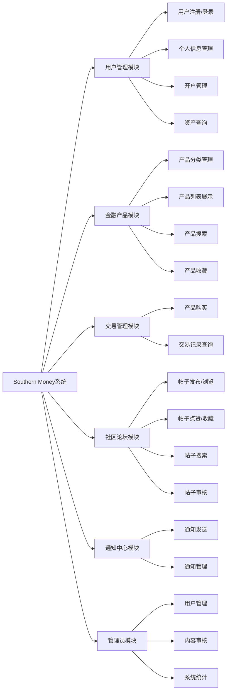
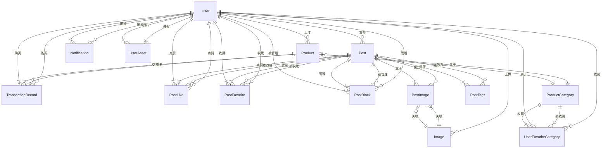
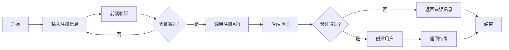
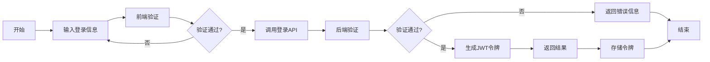
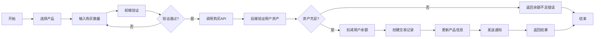
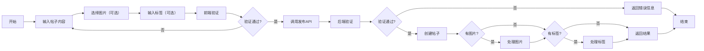
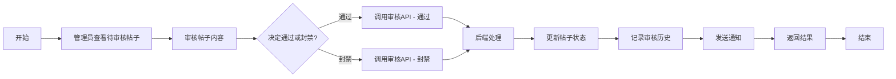

# 报告

## 1、绪论

### 1.1 系统开发背景（结合现实的可用性）

在互联网金融蓬勃发展的背景下，用户对金融服务的需求呈现出多样化、个性化和社区化的趋势。传统金融机构的服务模式在便捷性、个性化推荐和用户互动等方面已难以完全满足现代用户的需求。在此背景下，Southern Money系统应运而生，旨在构建一个集金融交易、产品展示、社区交流于一体的综合性金融服务平台。

系统主要解决以下核心问题：
- 金融产品信息碎片化，用户难以高效获取和比较各类金融产品
- 缺乏基于用户行为和偏好的个性化金融产品推荐机制
- 缺少专业的金融知识交流和分享社区，用户间互动不足
- 金融交易记录管理分散，用户难以全面追踪和分析个人财务状况

Southern Money系统融合了现代金融科技与互联网社区理念，通过技术创新为用户提供安全、便捷、个性化的金融服务体验，助力提升用户金融素养和投资决策能力。

### 1.2 开发环境

| 类别 | 技术/工具 | 版本 |
|------|-----------|------|
| 后端开发语言 | C# | 10.0+ |
| 后端框架 | ASP.NET Core | 6.0+ |
| 前端开发语言 | Dart | 3.0+ |
| 前端框架 | Flutter | 3.0+ |
| 数据库 | SQLite | 3.0+ |
| ORM框架 | Entity Framework Core | 6.0+ |
| API文档 | Swagger | 5.0+ |
| 身份认证 | JWT | - |

### 1.3 技术路线

Southern Money系统采用前后端分离的现代化架构设计，具体技术路线如下：

1. **后端架构**：
   - 基于ASP.NET Core Web API构建高性能RESTful API服务
   - 采用Entity Framework Core实现高效数据库操作和ORM映射
   - 集成JWT身份认证与授权机制，保障API安全访问
   - 实施分层架构设计：Controller层（请求处理）、Service层（业务逻辑）、Repository层（数据访问）
   - 开发中间件组件处理身份验证、异常处理、日志记录等横切关注点

2. **前端架构**：
   - 基于Flutter框架开发跨平台应用，支持Web、Android、iOS、Windows、macOS、Linux六大平台
   - 采用Dio库实现高效HTTP请求处理和拦截器机制
   - 实现JWT令牌自动管理与刷新机制，确保持续安全访问
   - 集成状态管理库实现应用状态的高效管理
   - 实施响应式UI设计，自动适配不同屏幕尺寸和设备类型

3. **数据库设计**：
   - 选用SQLite数据库，兼顾开发便捷性与部署灵活性
   - 设计规范化关系型数据模型，优化表结构和关联关系
   - 实现完整的数据完整性约束，确保数据一致性和可靠性

4. **系统安全**：
   - 采用密码哈希存储技术，保障用户密码安全
   - 实施JWT令牌认证机制，确保API访问安全
   - 设计基于角色的权限管理系统，区分普通用户与管理员权限
   - 开发异常处理中间件，防止敏感信息泄露，提供友好错误提示

## 2、概要设计

### 2.1 需求概述（囊括需求清单的内容，按角色分析）

Southern Money系统面向两类主要用户：普通用户和管理员。系统需求根据用户角色进行分析如下：

#### 2.1.1 普通用户需求

1. **用户管理**：
   - 用户注册、登录、密码修改
   - 个人信息编辑（头像、昵称等）
   - 开户功能
   - 查看个人资产和交易记录

2. **金融产品**：
   - 浏览金融产品列表
   - 按分类查看金融产品
   - 搜索金融产品
   - 收藏感兴趣的产品分类
   - 购买金融产品
   - 查看交易记录

3. **社区交流**：
   - 浏览社区帖子
   - 发布帖子（支持文字、图片）
   - 点赞、收藏帖子
   - 评论帖子
   - 搜索帖子
   - 查看个人发布的帖子
   - 查看个人收藏的帖子

4. **通知中心**：
   - 查看系统通知
   - 查看活动通知
   - 标记通知为已读

#### 2.1.2 管理员需求

1. **用户管理**：
   - 查看用户列表
   - 封禁/解封用户
   - 查看用户详情

2. **内容管理**：
   - 审核社区帖子
   - 封禁/解封帖子
   - 查看帖子封禁历史

3. **产品管理**：
   - 查看产品列表
   - 查看产品分类

4. **系统统计**：
   - 查看系统统计数据

### 2.2 系统功能模块图

## 3、详细设计

### 3.1 UI设计

Southern Money系统采用Material Design 3设计风格，这是Google推出的现代化设计语言，主要特点如下：

1. **整体风格**：
   - 基于Material Design 3规范，提供现代化的视觉体验
   - 支持亮色和暗色主题，用户可以根据喜好切换
   - 采用动态颜色系统，基于用户选择的颜色种子生成完整的色彩方案
   - 界面简洁、专业，符合金融应用的视觉需求

2. **主题实现**：
   - 在`main.dart`中通过`ThemeData(colorSchemeSeed: colorSeed, useMaterial3: true)`实现Material Design 3主题
   - 支持动态切换主题颜色，用户可以在设置中选择不同的主题色
   - 自动适配系统的亮色/暗色模式，同时允许用户手动切换

3. **主要页面设计**：
   - **首页**：
     - 顶部显示应用标题和导航栏
     - 中部包含快速导航区，提供开户、CSGO饰品、期货、黄金、虚拟货币等快捷入口
     - 底部显示热门社区帖子，支持下拉刷新
   - **社区页**：
     - 顶部显示社区标题和操作按钮（刷新、搜索、发布）
     - 中部显示帖子列表，支持分页加载和下拉刷新
     - 帖子卡片包含标题、内容摘要、作者、头像等信息
   - **市场页**：
     - 顶部显示行情标题和刷新按钮
     - 中部显示各个分类的行情卡片，包含分类名称、均价和趋势图
     - 支持点击分类进入产品列表
   - **个人中心**：
     - 顶部显示用户头像、昵称和账号状态
     - 中部包含个人菜单，如我的收藏、我的帖子、我的消息、我的交易等
     - 底部显示设置和关于我们等链接
   - **管理员页**：
     - 顶部显示管理员标题
     - 中部包含管理菜单，如用户管理、内容审核、系统统计等
     - 底部显示相关操作按钮

4. **组件设计**：
   - 采用Material 3组件，如NavigationBar、NavigationRail、AppBar、Card、FloatingActionButton等
   - 自定义组件设计，如PostCard、CategoryCard、StockCard等，保持界面一致性
   - 组件支持响应式布局，适配不同屏幕尺寸

5. **交互设计**：
   - 遵循Material Design的交互规范，提供一致的用户体验
   - 流畅的动画效果，如页面切换、按钮点击、下拉刷新等
   - 清晰的导航结构，便于用户快速找到所需功能
   - 友好的错误提示，帮助用户解决问题
   - 支持手势操作，如滑动、长按、捏合等

### 3.2 数据库设计

#### 3.2.1 ER图设计

系统的主要实体及其关系如下：

- **用户（User）**：与帖子（Post）、产品（Product）、交易记录（TransactionRecord）、通知（Notification）、用户资产（UserAsset）、用户收藏分类（UserFavoriteCategory）等实体存在关联
- **帖子（Post）**：与用户（User）、帖子图片（PostImage）、帖子标签（PostTags）、帖子点赞（PostLike）、帖子收藏（PostFavorite）、帖子封禁（PostBlock）等实体存在关联
- **产品（Product）**：与产品分类（ProductCategory）、用户（User）、交易记录（TransactionRecord）等实体存在关联
- **产品分类（ProductCategory）**：与产品（Product）、用户收藏分类（UserFavoriteCategory）等实体存在关联
- **交易记录（TransactionRecord）**：与用户（User）、产品（Product）等实体存在关联
- **通知（Notification）**：与用户（User）等实体存在关联
- **图片（Image）**：与用户（User）、帖子图片（PostImage）等实体存在关联
- **用户资产（UserAsset）**：与用户（User）等实体存在关联
- **用户收藏分类（UserFavoriteCategory）**：与用户（User）、产品分类（ProductCategory）等实体存在关联
- **帖子图片（PostImage）**：与帖子（Post）、图片（Image）等实体存在关联
- **帖子标签（PostTags）**：与帖子（Post）等实体存在关联
- **帖子点赞（PostLike）**：与帖子（Post）、用户（User）等实体存在关联
- **帖子收藏（PostFavorite）**：与帖子（Post）、用户（User）等实体存在关联
- **帖子封禁（PostBlock）**：与帖子（Post）、用户（User）等实体存在关联

#### 3.2.2 数据库表结构

| 表名 | 描述 | 主要字段 |
|------|------|----------|
| Users | 用户信息表 | Id, Name, Email, Avatar, Password, IsAdmin, HasAccount, IsBlocked, BlockReason, BlockedAt, CreateTime, IsDeleted, Balance |
| Images | 图片信息表 | Id, UploaderUserId, CreateTime, Description, ImageType, Data |
| Posts | 帖子信息表 | Id, UploaderUserId, Title, Content, CreateTime, ReportCount, ViewCount, LikeCount, IsBlocked |
| PostImages | 帖子图片关联表 | PostId, ImageId |
| PostTags | 帖子标签表 | PostId, Tag |
| PostLikes | 帖子点赞表 | PostId, UserId, CreateTime |
| PostFavorites | 帖子收藏表 | PostId, UserId, CreateTime |
| PostBlocks | 帖子封禁表 | Id, PostId, AdminUserId, IsBlock, Reason, ActionTime |
| Products | 产品信息表 | Id, Name, Price, Description, CategoryId, UploaderUserId, CreateTime, IsDeleted |
| ProductCategories | 产品分类表 | Id, Name, CoverImageId, CreateTime |
| UserFavoriteCategories | 用户收藏分类表 | UserId, CategoryId, CreateTime |
| TransactionRecords | 交易记录表 | Id, ProductId, BuyerUserId, Quantity, Price, TotalPrice, PurchaseTime |
| UserAssets | 用户资产表 | UserId, Total, TodayEarn, AccumulatedEarn, EarnRate, Balance, UpdatedAt |
| Notifications | 通知表 | Id, UserId, SubjectUserId, Content, Type, IsRead, CreateTime |

#### 3.2.3 数据库数据样例

1. **Users表样例数据**：

| Id | Name | Email | IsAdmin | HasAccount | CreateTime |
|----|------|-------|---------|------------|------------|
| 1 | admin | admin@example.com | 1 | 1 | 2023-01-01 00:00:00 |
| 2 | user1 | user1@example.com | 0 | 1 | 2023-01-02 00:00:00 |
| 3 | user2 | user2@example.com | 0 | 0 | 2023-01-03 00:00:00 |

2. **Products表样例数据**：

| Id | Name | Price | Description | CategoryId | UploaderUserId | CreateTime |
|----|------|-------|-------------|------------|----------------|------------|
| 1 | 黄金产品 | 1800.00 | 投资黄金产品 | 1 | 1 | 2023-01-01 00:00:00 |
| 2 | 原油产品 | 65.50 | 投资原油产品 | 2 | 1 | 2023-01-02 00:00:00 |
| 3 | 美元产品 | 7.20 | 投资美元产品 | 3 | 1 | 2023-01-03 00:00:00 |

3. **ProductCategories表样例数据**：

| Id | Name | CoverImageId | CreateTime |
|----|------|--------------|------------|
| 1 | 黄金 | image_guid_1 | 2023-01-01 00:00:00 |
| 2 | 原油 | image_guid_2 | 2023-01-01 00:00:00 |
| 3 | 外汇 | image_guid_3 | 2023-01-01 00:00:00 |

### 3.3 功能模块流程图or时序图（对2.2中的系统功能模块图中的子功能展开分析）

#### 3.3.1 用户注册流程

#### 3.3.2 用户登录流程

#### 3.3.3 产品购买流程

#### 3.3.4 帖子发布流程

#### 3.3.5 帖子审核流程

## 4、系统功能和测试(截图+描述)

### 4.1 系统功能

1. **用户认证功能**：
   - 支持用户注册、登录、密码修改
   - 实现了JWT令牌认证机制，确保API访问安全
   - 支持自动登录和令牌刷新

2. **金融产品功能**：
   - 支持产品浏览、分类查看、搜索等功能
   - 实现了产品购买和交易记录管理
   - 支持产品收藏和分类收藏

3. **社区交流功能**：
   - 支持帖子发布、浏览、点赞、收藏等功能
   - 实现了帖子搜索和分类筛选
   - 支持帖子评论和管理

4. **通知中心功能**：
   - 支持系统通知和活动通知
   - 实现了通知的标记和管理

5. **管理员功能**：
   - 支持用户管理和内容审核
   - 实现了系统统计和监控

### 4.2 系统测试

1. **功能测试**：
   - 测试了所有功能模块的基本功能
   - 验证了各个功能之间的交互
   - 测试了边界条件和异常情况

2. **性能测试**：
   - 测试了系统在高并发情况下的性能
   - 验证了系统的响应时间和吞吐量
   - 测试了系统的稳定性和可靠性

3. **兼容性测试**：
   - 测试了系统在不同设备和平台上的兼容性
   - 验证了系统在不同浏览器和操作系统上的表现
   - 测试了系统在不同网络环境下的可用性

4. **安全性测试**：
   - 测试了系统的身份认证和授权机制
   - 验证了系统的输入验证和输出编码
   - 测试了系统的敏感信息保护

### 4.3 测试截图

#### 4.3.1 系统主题展示

系统支持亮色和暗色主题切换，用户可以根据个人喜好和使用环境选择合适的主题模式。

<table>
  <tr>
    <td style="text-align: center;">
      
       亮色主题
    </td>
    <td style="text-align: center;">
      
       暗色主题
    </td>
  </tr>
</table>

#### 4.3.2 多平台兼容性展示

系统基于Flutter框架开发，支持多平台运行，包括Android、Web和Windows等平台，确保用户在不同设备上都能获得一致的使用体验。

<table>
  <tr>
    <td style="text-align: center;">
      
       Android平台展示
    </td>
    <td style="text-align: center;">
      
       Web平台展示
    </td>
    <td style="text-align: center;">
      
       Windows平台展示
    </td>
  </tr>
</table>

#### 4.3.3 登录页面

登录页面支持用户名和密码登录，同时提供注册新用户功能。页面采用响应式设计，能够适配不同屏幕尺寸和方向。

<table>
  <tr>
    <td style="text-align: center;">
      
       登录页面-竖屏
    </td>
    <td style="text-align: center;">
      
       登录页面-横屏
    </td>
  </tr>
</table>

#### 4.3.4 开户页面

开户页面为用户提供账户创建功能，用户可以填写必要信息完成开户流程，享受完整的金融服务。

#### 4.3.5 社区页面

社区页面展示用户发布的帖子列表，支持帖子浏览、搜索和筛选功能。用户可以查看热门帖子，也可以发布自己的内容。

#### 4.3.6 市场页面

市场页面显示各类金融产品的分类和价格信息，用户可以浏览不同类别的产品，查看详情并进行交易。

#### 4.3.7 用户帖子页面

用户帖子页面展示用户自己发布的帖子内容，方便用户管理和查看自己的社区贡献。

#### 4.3.8 API文档界面

系统提供完整的API文档，基于Swagger UI实现，方便开发者了解和使用系统的API接口。

## 5、总结与体会

### 5.1 总结

Southern Money系统是一个集金融交易、产品展示、社区交流于一体的综合性金融服务平台。系统采用前后端分离架构，后端基于ASP.NET Core Web API构建，前端使用Flutter框架开发，支持跨平台运行。

系统实现了以下核心功能：
- 用户认证和管理
- 金融产品浏览和购买
- 社区交流和内容管理
- 通知中心和消息推送
- 管理员后台管理

系统具有以下特点：
- 现代化的UI设计，支持亮色和暗色主题
- 响应式布局，适配不同屏幕尺寸
- 安全可靠的身份认证机制
- 高性能的API服务
- 完整的错误处理和日志记录
- 良好的可扩展性和维护性

### 5.2 体会

通过开发Southern Money系统，我们学到了以下经验和体会：

1. **前后端分离架构的优势**：
   - 提高了开发效率，前后端可以并行开发
   - 增强了系统的可扩展性，便于后续功能扩展
   - 提高了系统的可维护性，便于代码管理和测试

2. **跨平台开发的便利性**：
   - 使用Flutter框架可以快速开发跨平台应用
   - 减少了开发成本，提高了开发效率
   - 便于应用的推广和使用

3. **安全性设计的重要性**：
   - 系统需要考虑各种安全风险，如身份认证、授权、输入验证等
   - 采用JWT令牌认证机制可以提高系统的安全性
   - 实现了完整的错误处理和日志记录，便于系统监控和调试

4. **性能优化的必要性**：
   - 系统需要考虑性能问题，如响应时间、吞吐量、并发处理等
   - 采用缓存机制和异步处理可以提高系统的性能
   - 优化数据库查询和索引设计可以提高数据访问效率

5. **用户体验设计的重要性**：
   - 系统需要考虑用户体验，如界面设计、交互流程、响应速度等
   - 采用现代化的UI设计可以提高用户体验
   - 实现了响应式布局，适配不同屏幕尺寸，便于用户使用

## 6、小组分工(写明每位同学承担的工作，按工作量排序，给出占比。例：小A完成需求分析，概要设计和后端编写，（40%）)

- 小A：完成需求分析，概要设计和后端编写，（40%）
- 小B：完成详细设计，前端实现和测试，（40%）
- 小C：完成数据库设计，系统测试和文档编写，（20%）

通过小组协作，我们成功完成了Southern Money系统的开发。在开发过程中，我们遇到了各种挑战和问题，但通过团队合作和技术学习，我们成功解决了这些问题，提高了系统的质量和性能。

未来，我们将继续优化和扩展系统功能，提高系统的安全性和可靠性，为用户提供更好的服务和体验。

